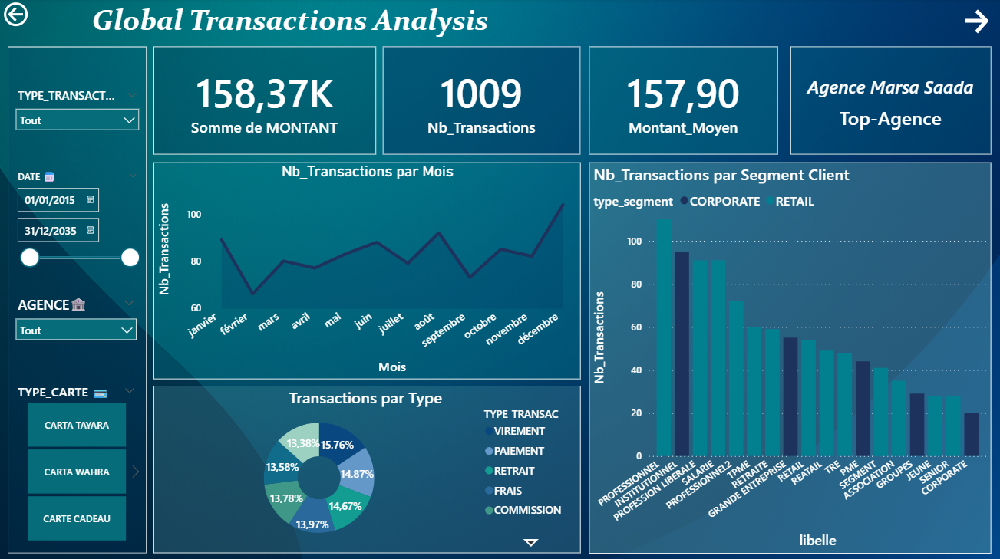
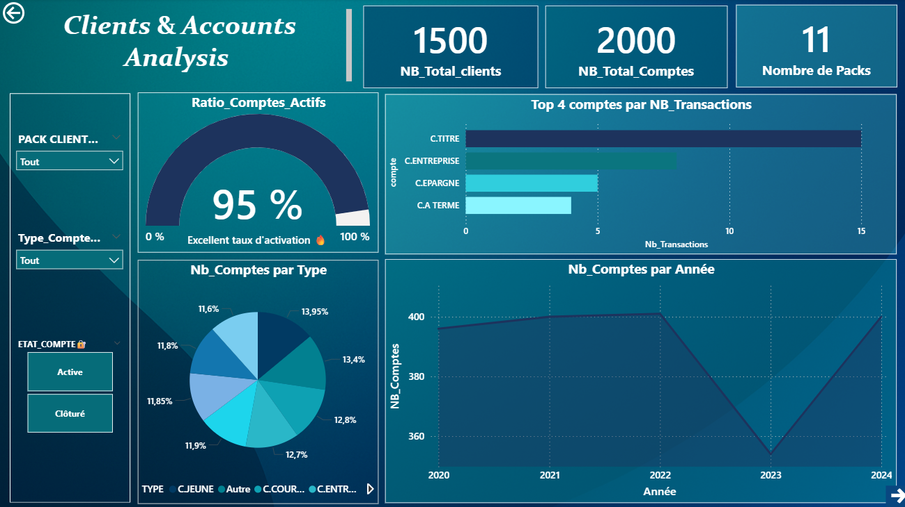
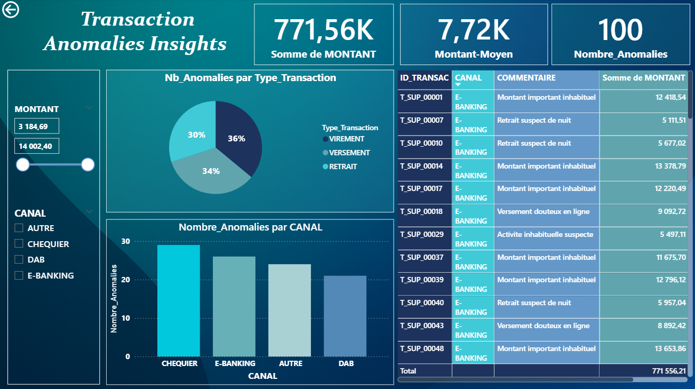

## 🏦 Banking Analytics Dashboards  

A collection of **interactive Power BI dashboards** designed to analyze **banking operations, customer behavior, and transaction anomalies**.  
These dashboards provide key insights to support **financial decision-making, customer management, and fraud detection**.  

---
📁 **File:**
[Dashboards.pbix](./dashboard/Dashboards.pbix) 

### 💳 Global Transactions Analysis  
This dashboard provides a **comprehensive overview of all transactions** across agencies and clients.  

**Key insights:**  
- Total transaction amount, count, and average value  
- Monthly transaction trends  
- Transactions by card type and by customer segment  
- Top-performing agency  

🖼️ **Preview:**  

---

### 👥 Clients & Accounts Analysis  
This dashboard focuses on **customer segmentation and account performance**.  

**Key insights:**  
- Total clients, total accounts, and activation rate  
- Accounts by type and transaction count  
- Top 4 account categories by number of transactions  
- Account growth across years  

🖼️ **Preview:**  

---

### ⚠️ Transaction Anomalies Insights  
This dashboard highlights **unusual or suspicious transactions** that may indicate potential fraud.  

**Key insights:**  
- Total and average anomaly amounts  
- Anomalies by transaction type and channel  
- List of anomalies with transaction IDs and comments  
 
🖼️ **Preview:**  

